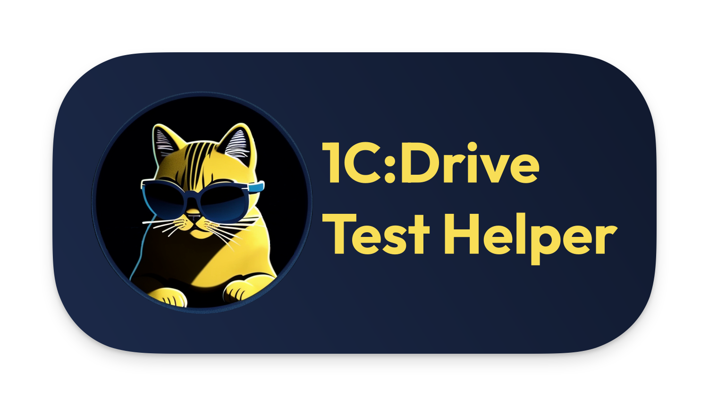
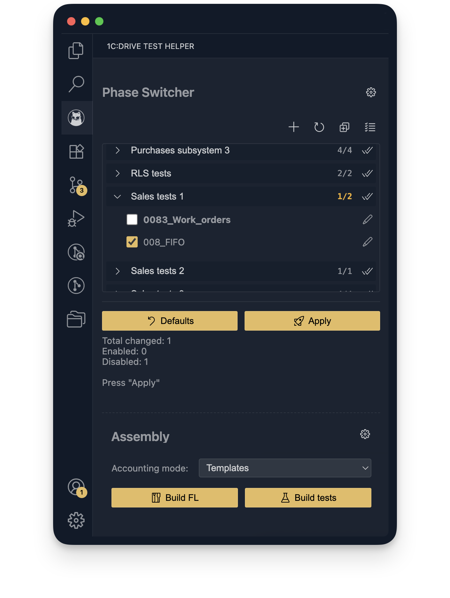
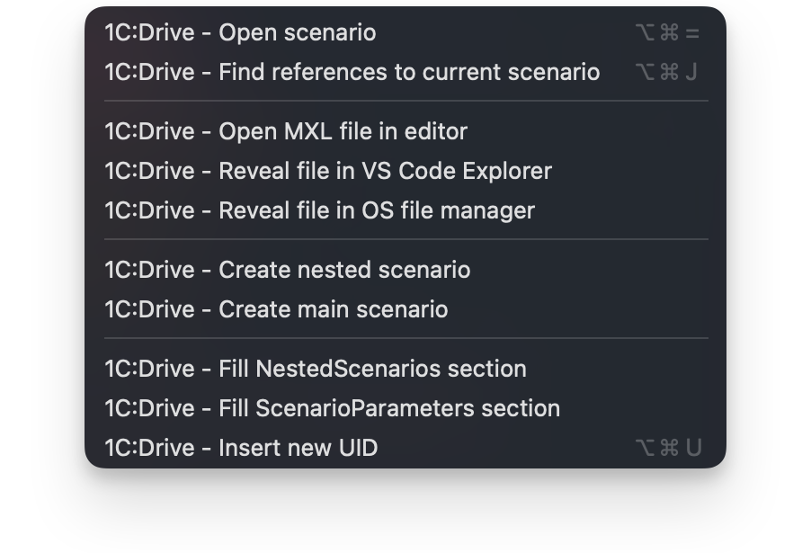

# 1C:Drive Test Helper
<p align="center">
  <br>
  <a href="CHANGELOG.en.md"></a>
</p>

<p align="center">
  <a href="README.md">🇷🇺 Русский</a> | <a href="README.en.md">🇺🇸 English</a>
</p>

Helper for developing and managing 1C:Drive regression tests in VS Code. Speeds up navigation between scenarios, creating new scenarios from templates, and managing phases and builds for test runs.

# Features

## Working with scenario text:
* **Autocompletion and hints:** 
    * Suggests scenario call steps from the project folder, including their parameters (uses Fuzzy Match).
    * Suggests Gherkin steps from Vanessa Automation as you type (uses Fuzzy Match). Supports multiple translations.
    * Shows step description from the Gherkin step library for Vanessa Automation when hovering over a step line in a YAML file. Shows description in the language of entered text and variant of this step in other language.
    * To ensure the relevance of autocompletion and hints for Gherkin steps for Vanessa Automation, the extension supports loading the `steps.htm` file from an external resource.

* **Quick navigation:**
    * **Open scenario:** When on a line like `And ScenarioName`, you can quickly open the corresponding `.yaml` file where `Name: "ScenarioName"` is defined.
    * **Find current scenario calls:** From the current scenario file (`scen.yaml`), you can quickly see a list of all places (`And Name...`) where this scenario is used.

* **File operations:**
    * **Open MXL file in editor:** From the context menu on a **selected** filename, you can find and open it in "1C:Enterprise — work with files".
    * **Show file in VS Code explorer:** Quickly finds a file by **selected** name and highlights it in the VS Code sidebar. Works with both nested files and scenario files.
    * **Show file in system explorer:** Finds a file by **selected** name and opens its location in the system explorer (Windows Explorer, Finder). Works with both nested files and scenario files.
    * *For all search commands, a two-level search is used: first in the `files` folder next to the current and nested scenarios, then throughout the `tests` directory.*

* **Creating scenarios from templates:**
    * **Create nested scenario:**
        * Called from context menu or command palette (`1C:Drive - Create nested scenario`) or from the Phase Switcher panel.
        * Requests Name (can be pre-filled if the command is called from a pre-written call line `And ...`), Test numeric code, and Parent folder.
        * Automatically creates structure: 
            * `<Parent folder>/<Code>/scen.yaml`
            * `<Parent folder>/<Code>/files/`
    * **Create main scenario:**
        * Called from context menu or command palette (`1C:Drive - Create main scenario`) or from the Phase Switcher panel.
        * Requests Main scenario name, **metadata for Phase Switcher** (Phase/tab name, Sort order, Default state) and Parent folder.
        * Automatically creates structure:
            * `<Parent folder>/<Name>/scen.yaml`
            * `<Parent folder>/<Name>/test/<Name>.yaml`
            * `<Parent folder>/<Name>/files/`

* **Code insertion (Snippets):**
    * **Fill NestedScenarios section:** Quickly inserts missing blocks in the `NestedScenarios` (`ВложенныеСценарии`) section for all found scenario calls in the open file with corresponding `Name` and `UID`.
    * **Fill ScenarioParameters section:** Quickly inserts missing blocks in the `ScenarioParameters` (`ПараметрыСценария`) section for all found parameters in the open file.
    * **Replace tabs with spaces:** Replaces all tabulations with 4 spaces in the open file.
    * **Insert new UID:** Generates and inserts a new UUID v4 at the current cursor position.


## 1C:Drive Test Helper Panel:
To open, click on the extension icon  in the sidebar (Activity Bar).

### Phase Switcher Panel:

Successor of the [Phase Switcher](https://github.com/kakoytochelik/PhaseSwitcher) application inside the VS Code extension.

The main difference is that there's no longer a need for external configuration files, everything happens automatically!
  * **Purpose:** Allows you to quickly enable and disable test sets for different runs.
  * **Test detection:** The extension scans the `tests/RegressionTests/Yaml/Drive/` folder (therefore VS Code needs to be opened in the project root!).
  * **Test metadata:** To display a test in Phase Switcher, the `scen.yaml` file must contain a line `Name: "Test name"` and special comment markers:
      ```yaml
      # PhaseSwitcher_Tab:            # Required - Tab name in UI/test phase
      # PhaseSwitcher_Default:        # Optional - Whether the test is enabled by default (true/false)
      # PhaseSwitcher_OrderOnTab:     # Optional - Order within the phase
      ```
  * **Interface:**
      * Tests are grouped by phases in a **tree view (Tree-View)**. Each phase is an expandable group.
      * The header of each test group displays the **enabled test counter** in that phase.
      * Checkboxes show the current test state (enabled/disabled/not found).
      * **Bold font** in the test name indicates that its state has been changed but not yet applied.
      * Control buttons:
          * `Settings`: Open extension settings.
          * `Create scenario`: Dropdown menu for creating new Main or Nested scenarios.
          * `Refresh`: Rescan files and check state on disk, and update the scenario list for line autocompletion.
          * `Collapse/Expand all phases`: Toggles the expansion of **all** phases.
          * `Toggle all`: Toggle the state of **all** active tests in **all** phases.
          * `Toggle phase`: Allows you to toggle tests within a specific phase. Located to the right of the enabled test counter. 
          * `Defaults`: Reset the state of **all** tests according to their `# PhaseSwitcher_Default:` marker.
          * `Apply`: Physically moves parameter folders `./test/` for changed tests between directories `tests/RegressionTests/Yaml/Drive/` and `RegressionTests_Disabled/Yaml/Drive/`, thus switching the test state.
      * Click the pencil button to open the scenario in the editor.
      * **Status bar:** Displays current status (loading, presence of changes, application result).

### Build Panel:
#### FirstLaunch archive build:
  * Allows you to build a FirstLaunch.zip archive for testing regional versions.
  * `Build FL`: builds the archive, substitutes the current configuration version from the branch into the files.
  * After successfully building the archive, it offers to choose a location for saving, after which you can open the directory with the saved file from the notification.

#### Test build:
  * Allows you to run the build script (BuildScenarioBDD) with installed parameters.
  * **Process indication:** During the build, a progress bar is displayed as a notification.
  * **Error notifications:** In case of unsuccessful build, a notification appears with a button for quick navigation to the log file.
  * In the extension settings, you can specify test email parameters and disable automatic opening of the `Output` panel when starting the build.
  * Automatically cleans up "unnecessary" steps from certain tests (001_Company, I_start_my_first_launch)
  * Build management:
      * `Accounting mode` dropdown: you can select the accounting type before building tests.
      * `Build tests`: runs the build script.
  * Separate status bar for the build process.
  * After successful build, you can open the directory with the built tests.

## Requirements

* Visual Studio Code;
* Project opened in the repository root folder;
* For opening MXL files from scenario text: installed [1C:Enterprise — File Workshop](https://v8.1c.ru/static/1s-predpriyatie-rabota-s-faylami/);
* For building scenarios: filled paths and parameters in extension settings.

## Setup and usage

1.  **Installation:**
    * Install from [Visual Studio Marketplace](https://marketplace.visualstudio.com/items?itemName=AlexeyEremeev.1c-drive-test-helper)
    * Or Extensions View -> "..." -> "Install from VSIX..." -> Select the downloaded/built `.vsix` file.
2.  **Configuration:**<br>
    You can access the extension settings through the standard method via general settings or **via the settings button from the Activity Bar panel**.
    * `Enable "Phase Switcher" panel`: toggles the display of the **Phase Switcher section in Activity Bar** (enabled by default)
    * `Enable "Build" panel`: toggles the display of the **Test Builder section in Activity Bar** (enabled by default)
    * `Language override`: sets the extension's interface language independently of VS Code's language (system/en/ru). Does not affect the display language of settings page and context menus (they are displayed in the VS Code interface language).
    * `Gherkin steps URL`: URL for loading the `steps.htm` file. Leave empty to use the file from the extension, or specify your own for dynamic updates.
    * `Auto collapse on open`: Automatically collapse `NestedScenarios` (`ВложенныеСценарии`) and `ScenarioParameters` (`ПараметрыСценария`) sections when opening a file.
    * **Test email settings**:
      * `Email Address`: email address used in tests
      * `Email Password`: password for the email used in tests. For security purposes, it is set separately through a command, saved in VS Code's secure storage (`SecretStorage`). Can be removed from storage with a separate command.
      * `Email Incoming Server`: Incoming mail server (EMailTestIncomingMailServer).
      * `Email Incoming Port`: Incoming mail port (EMailTestIncomingMailPort).
      * `Email Outgoing Server`: Outgoing mail server (EMailTestOutgoingMailServer).
      * `Email Outgoing Port`: Outgoing mail port (EMailTestOutgoingMailPort).
      * `Email Protocol`: Mail protocol, IMAP or POP3 (EMailTestProtocol).
    * **Build settings**:
      * `Split Feature Files`: Save files attached to tests in a separate folder (disabled by default).
      * `Show Output Panel`: Show Output panel when building tests (disabled by default).
    * **System path settings**:
      * `Empty Infobase`: Path to the empty file infobase directory on which the scenario build processing will be launched (EmptyInfobasePath).
      * `Build Path`: Path to the folder for built tests (BuildPath).
      * `one CEnterprise Exe`: Full path to the 1cv8.exe executable (Windows) or 1cestart (macOS).
      * `File Workshop Exe`: Full path to '1C:Enterprise — File Workshop' (1cv8fv.exe).

3.  **Commands:**
    * Most commands are available through the **context menu** (right-click in editor) or **command palette** (`Ctrl+Shift+P` or `Command+Shift+P`, start typing `1C:Drive`).
    * For navigation and insertion, **hotkeys** can be used (check or configure them in Keyboard Shortcuts).
4.  **Phase Switcher:**
    * Open via the **icon  in Activity Bar**.
    * Select the desired phase from the dropdown list.
    * Check/uncheck tests. Names of changed tests will become bold.
    * Click `Apply`.
    * Use `Refresh` if you manually changed the test folder structure.
5.  **Build:**
    * Open via the **icon  in Activity Bar**.
    * FirstLaunch archive build:
      * Click `Build FL`
      * Choose a location for saving
    * Test build:
      * Select accounting mode `Accounting mode`
      * Click `Build tests`

## Screenshots

<table>
<tr>
  <td width="50%" align="center" valign="top">
  <em>Panel in Activity Bar:</em><br>
  
  </td>
  <td width="50%" align="center" valign="top">
  <em>Context menu:</em><br>
  
  </td>
</tr>
<tr>
<td align="center" valign="top">
<em>Line autocompletion:</em><br>

</td>
<td align="center" valign="top">
<em>Step description window:</em><br>

</td>
</tr>
</table>

## Known issues

* Building tests on macOS takes much longer than on Windows. Also, due to the peculiarities of the 1C platform on macOS, tracking the build execution status occurs by tracking the creation of the result file, not by the completion of the 1C process.
* Open MXL in editor feature is unavailable on macOS.
* Work on Linux has not been tested.
