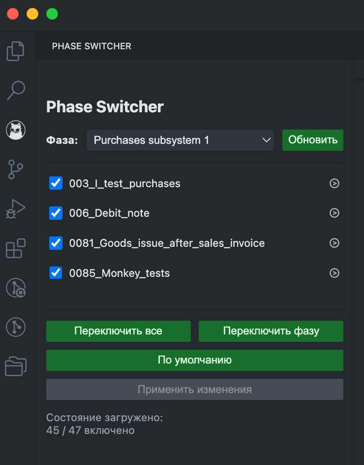
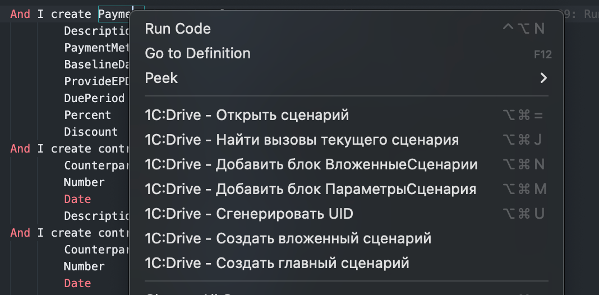
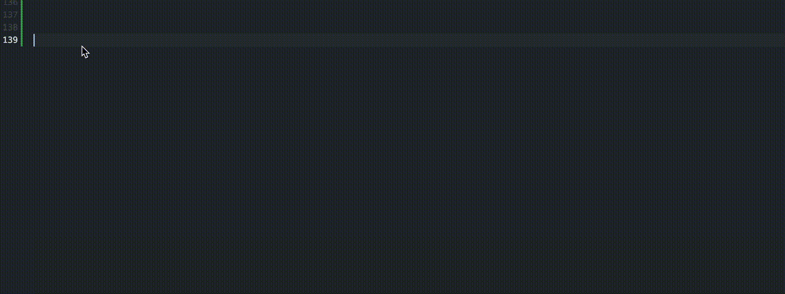
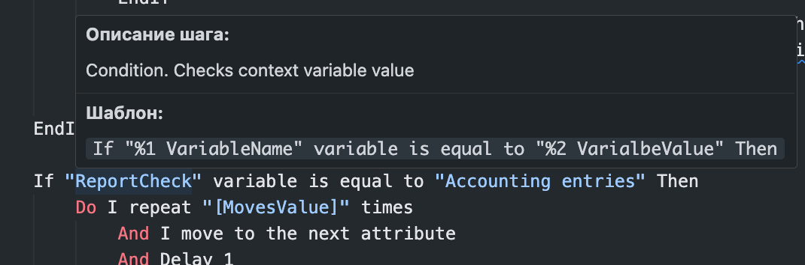

# 1C:Drive Test Helper
### Помощник для тестов 1С:Drive
[](./package.json) 

<p align="center">
  
</p>


Помощник для разработки и управления регрессионными тестами 1C:Drive в VS Code. Ускоряет навигацию между сценариями, создание новых сценариев по шаблонам и управление фазами для тестовых запусков.

## Возможности

* **Автодополнение и Подсказки:** 
    * Предлагает варианты шагов Gherkin для Vanessa Automation (используется Fuzzy Match).
    * Показывает описание шага из библиотеки шагов Vanessa Automation при наведении мыши на строку шага в YAML файле.

* **Быстрая Навигация:**
    * **Переход к определению сценария:** Находясь на строке вида `And ИмяСценария`, нажмите комбинацию клавиш (`Command+Option+=` или `Ctrl+Alt+=`) или выберите пункт в контекстном меню, чтобы быстро открыть `.yaml` файл, где определено `Имя: "ИмяСценария"`.
    * **Поиск всех использований сценария:** Откройте файл сценария (`scen.yaml`), кликните правой кнопкой мыши в любом месте текущего сценария и выберите "1C:Drive - Найти вызовы текущего сценария" или используйте комбинацию `Ctrl+Alt+J` или `Command+Option+J`. Расширение покажет список всех мест (`And Имя...`), где используется этот сценарий, в виде удобного списка QuickPick.

* **Создание Сценариев по Шаблонам:**
    * **Создать вложенный сценарий:**
        * Вызывается из контекстного меню или палитры команд (`1C:Drive - Создать вложенный сценарий`).
        * Запрашивает Имя (может предзаполняться, если команда вызвана с заранее написанной строки вызова `And ...`), Номерной код теста и Родительскую папку.
    * **Создать главный сценарий:**
        * Вызывается из контекстного меню или палитры команд (`1C:Drive - Создать главный сценарий`).
        * Запрашивает Имя главного сценария, **метаданные для Phase Switcher** (Имя фазы/вкладки, Порядок сортировки, Состояние по умолчанию) и Родительскую папку.
        * Автоматически создает структуру:
            * `<Родительская папка>/<Имя>/scen.yaml`
            * `<Родительская папка>/<Имя>/test/<Имя>.yaml`

* **Вставка Кода (Сниппеты):**
    * **Вставить ссылку на вложенный сценарий:** Быстро вставляет блок в секцию `ВложенныеСценарии` (вызывается по `Ctrl+Alt+N` или `Command+Option+N` или из контекстного меню).
    * **Вставить параметр сценария:** Быстро вставляет блок в секцию `ПараметрыСценария` (вызывается по `Ctrl+Alt+M` или `Command+Option+N` или из контекстного меню).
    * **Вставить новый UID:** Генерирует и вставляет новый UUID v4 в текущую позицию курсора (вызывается по `Ctrl+Alt+U` или `Command+Option+U` или из контекстного меню).

* **Phase Switcher:** 

  Развитие приложения [Phase Switcher](https://github.com/kakoytochelik/PhaseSwitcher) внутри расширения для VS Code.
  
  Главное отличие - больше нет необходимости во внешних файлах конфигурации, все происходит автоматически!
    * **Открытие:** Нажмите на иконку расширения  в боковой панели (Activity Bar)
    * **Назначение:** Позволяет быстро включать и выключать наборы тестов для разных запусков.
    * **Обнаружение тестов:** Расширение сканирует папку `tests/RegressionTests/Yaml/Drive/` (поэтому VS Code нужно открывать в корне проекта!).
    * **Метаданные тестов:** Для отображения теста в Phase Switcher, файл `scen.yaml` должен содержать строку `Имя: "Имя теста"` и специальные комментарии-маркеры:
        ```yaml
        # PhaseSwitcher_Tab:            # Обязательно - Название вкладки в UI/тестовой фазы
        # PhaseSwitcher_Default:        # Необязательно - Включен ли тест по умолчанию (true/false)
        # PhaseSwitcher_OrderOnTab:     # Необязательно - Порядок внутри фазы
        ```
    * **Интерфейс:**
        * Тесты сгруппированы по фазам (вкладкам) в выпадающем списке.
        * Чекбоксы показывают текущее состояние теста (включен/выключен/не найден).
        * **Жирный шрифт** у названия теста указывает на то, что его состояние было изменено, но еще не применено.
        * Кнопки управления:
            * `Обновить`: Пересканировать файлы и проверить состояние на диске.
            * `Переключить все`: Переключить состояние **всех** активных тестов **во всех** фазах.
            * `Переключить фазу`: Переключить состояние только тех тестов, которые видны в **текущей** выбранной фазе.
            * `По умолчанию`: Сбросить состояние **всех** тестов в соответствии с их маркером `# PhaseSwitcher_Default:`.
            * `Применить изменения`: Физически перемещает параметрические папки `./test/` для измененных тестов между директориями `tests/RegressionTests/Yaml/Drive/` и `RegressionTests_Disabled/Yaml/Drive/`, тем самым переключает состояние теста.
        * По кнопке `⧁` можно открыть сценарий в редакторе
        * **Статус-бар:** Отображает текущий статус (загрузка, наличие изменений, результат применения).

## Требования

* Visual Studio Code
* Проект открыт в VS Code так, чтобы корень проекта соответствовал ожидаемой структуре (например, содержал папки `tests` и `RegressionTests_Disabled`).
* Для сборки Node.js и npm.

## Использование

1.  **Установка:**
    * Или: Extensions View -> "..." -> "Install from VSIX..." -> Выберите скачанный/собранный `.vsix` файл.
2.  **Команды:**
    * Большинство команд доступны через **контекстное меню** (правый клик в редакторе) или **палитру команд** (`Ctrl+Shift+P` или `Command+Shift+P`, начните вводить `1C:Drive`).
    * Для навигации и вставки могут использоваться **горячие клавиши** (проверьте или настройте их в Keyboard Shortcuts).
3.  **Phase Switcher:**
    * Откройте через **иконку  в Activity Bar**.
    * Выберите нужную фазу из выпадающего списка.
    * Отметьте/снимите отметки у тестов. Названия измененных тестов станут жирными.
    * Нажмите `Применить изменения`.
    * Используйте `Обновить`, если вы вручную изменили структуру папок тестов.

## Скриншоты

<p align="center">
  
  <br>
  <em>Панель Phase Switcher</em>
  <br>
  <br>
</p>

<p align="center">
  
  <br>
  <em>Контекстное меню</em>
  <br>
  <br>
</p>

<p align="center">
  
  <br>
  <em>Автодополнение строк</em>
  <br>
  <br>
</p>

<p align="center">
  
  <br>
  <em>Окно описания шага</em>
  <br>
  <br>
</p>

## Известные Проблемы

* При создании нового Главного сценария, список тестов в Phase Switcher нужно обновить вручную через кнопку `Обновить`

## История Изменений

См. `CHANGELOG.md`