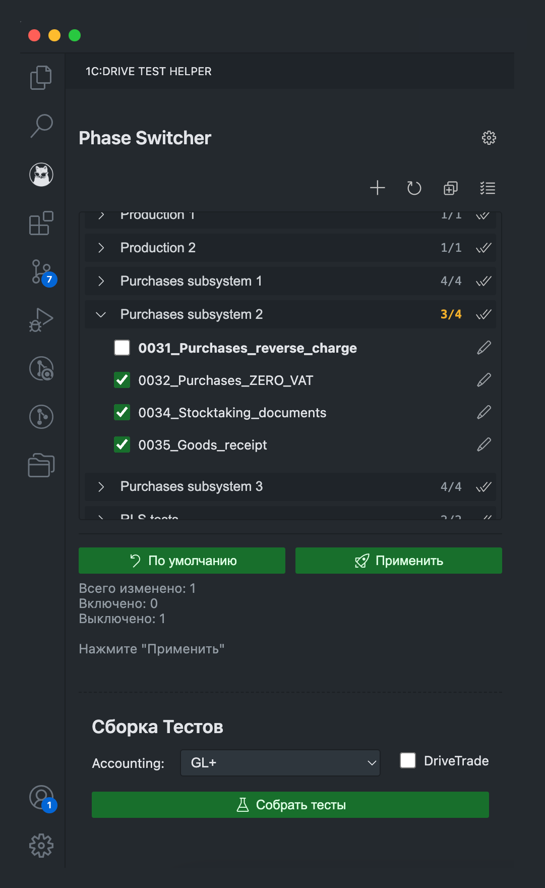
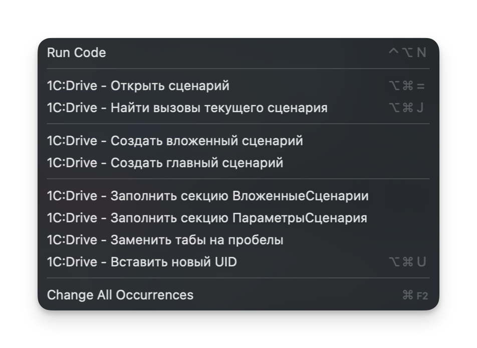
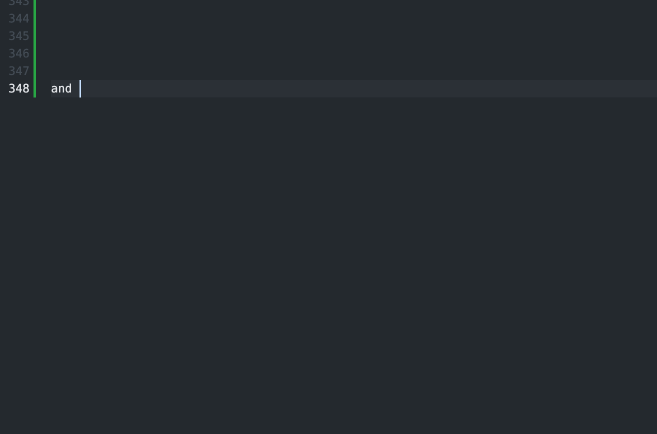
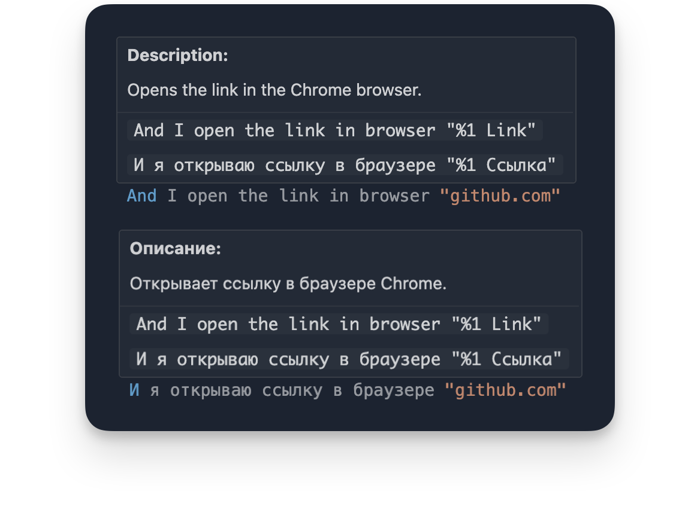

# 1C:Drive Test Helper
## Помощник для тестов 1C:Drive
[](./package.json) 

<p align="center">
  
</p>

Помощник для разработки и управления регрессионными тестами 1C:Drive в VS Code. Ускоряет навигацию между сценариями, создание новых сценариев по шаблонам и управление фазами и сборкой для тестовых запусков.

# Возможности

## Работа с текстом сценариев:
* **Автодополнение и подсказки:** 
    * Предлагает варианты шагов вызовов сценариев из папки проекта, в том числе с учетом их параметров (используется Fuzzy Match).
    * Предлагает варианты шагов Gherkin из Vanessa Automation по мере ввода (используется Fuzzy Match).
    * Показывает описание шага из библиотеки шагов Gherkin для Vanessa Automation при наведении мыши на строку шага в YAML файле.
    * Для обеспечения актуальности автодополнения и подсказок по шагам Gherkin для Vanessa Automation, расширение поддерживает загрузку файла `steps.htm` с внешнего ресурса.

* **Быстрая навигация:**
    * **Открыть сценарий:** Находясь на строке вида `And ИмяСценария`, можно быстро открыть соответствующий `.yaml` файл, где определено `Имя: "ИмяСценария"`.
    * **Найти вызовы текущего сценария:** Из текущего файла сценария (`scen.yaml`) можно быстро увидеть список всех мест (`And Имя...`), где используется этот сценарий.

* **Работа с файлами:**
    * **Открыть MXL файл в редакторе:** Из контекстного меню на **выделенном** имени файла можно найти и открыть его в "1С:Предприятие — работа с файлами".
    * **Показать файл в проводнике VS Code:** Быстро находит файл по **выделенному** имени и подсвечивает его в боковой панели VS Code. Работает как с вложенными файлами, так и с файлами сценариев.
    * **Показать файл в системном проводнике:** Находит файл по **выделенному** имени и открывает его расположение в системном проводнике (Windows Explorer, Finder). Работает как с вложенными файлами, так и с файлами сценариев.
    * *Для всех команд поиска используется двухуровневый поиск: сначала в папке `files` рядом с текущим и вложенными сценариями, а затем по всей директории `tests`.*

* **Создание сценариев по шаблонам:**
    * **Создать вложенный сценарий:**
        * Вызывается из контекстного меню или палитры команд (`1C:Drive - Создать вложенный сценарий`) или из панели Phase Switcher.
        * Запрашивает Имя (может предзаполняться, если команда вызвана с заранее написанной строки вызова `And ...`), Номерной код теста и Родительскую папку.
        * Автоматически создает структуру: 
            * `<Родительская папка>/<Код>/scen.yaml`
            * `<Родительская папка>/<Код>/files/`
    * **Создать главный сценарий:**
        * Вызывается из контекстного меню или палитры команд (`1C:Drive - Создать главный сценарий`) или из панели Phase Switcher.
        * Запрашивает Имя главного сценария, **метаданные для Phase Switcher** (Имя фазы/вкладки, Порядок сортировки, Состояние по умолчанию) и Родительскую папку.
        * Автоматически создает структуру:
            * `<Родительская папка>/<Имя>/scen.yaml`
            * `<Родительская папка>/<Имя>/test/<Имя>.yaml`
            * `<Родительская папка>/<Имя>/files/`

* **Вставка кода (Сниппеты):**
    * **Заполнить секцию ВложенныеСценарии:** Быстро вставляет в секцию `ВложенныеСценарии` отсутствующие блоки для всех найденных в открытом файле вызовов сценариев с соответствующими `Имя` и `UID`.
    * **Заполнить секцию ПараметрыСценария:** Быстро вставляет в секцию `ПараметрыСценария` отсутствующие блоки для всех найденных в открытом файле параметров.
    * **Заменить табы на пробелы:** Заменяет в открытом файле все табуляции на 4 пробела.
    * **Вставить новый UID:** Генерирует и вставляет новый UUID v4 в текущую позицию курсора.


## Панель 1C:Drive Test Helper:
Для открытия, нажмите на иконку расширения  в боковой панели (Activity Bar).

### Phase Switcher:

Развитие приложения [Phase Switcher](https://github.com/kakoytochelik/PhaseSwitcher) внутри расширения для VS Code.

Главное отличие - больше нет необходимости во внешних файлах конфигурации, все происходит автоматически!
  * **Назначение:** Позволяет быстро включать и выключать наборы тестов для разных запусков.
  * **Обнаружение тестов:** Расширение сканирует папку `tests/RegressionTests/Yaml/Drive/` (поэтому VS Code нужно открывать в корне проекта!).
  * **Метаданные тестов:** Для отображения теста в Phase Switcher, файл `scen.yaml` должен содержать строку `Имя: "Имя теста"` и специальные комментарии-маркеры:
      ```yaml
      # PhaseSwitcher_Tab:            # Обязательно - Название вкладки в UI/тестовой фазы
      # PhaseSwitcher_Default:        # Необязательно - Включен ли тест по умолчанию (true/false)
      # PhaseSwitcher_OrderOnTab:     # Необязательно - Порядок внутри фазы
      ```
  * **Интерфейс:**
      * Тесты сгруппированы по фазам в **древовидном представлении (Tree-View)**. Каждая фаза является раскрывающейся группой.
      * В заголовке каждой группы тестов отображается **счетчик включенных тестов** в данной фазе.
      * Чекбоксы показывают текущее состояние теста (включен/выключен/не найден).
      * **Жирный шрифт** у названия теста указывает на то, что его состояние было изменено, но еще не применено.
      * Кнопки управления:
          * `Настройки`: Открыть настройки расширения.
          * `Создать сценарий`: Выпадающее меню для создания новых Главных или Вложенных сценариев.
          * `Обновить`: Пересканировать файлы и проверить состояние на диске, а также обновить список сценариев для автодополнения строки.
          * `Свернуть/Развернуть все фазы`: Переключает раскрытие **всех** фаз.
          * `Переключить все`: Переключить состояние **всех** активных тестов **во всех** фазах.
          * `Переключить фазу`: Позволяют переключить тесты внутри конкретной фазы. Находятся справа от счетчика включенных тестов. 
          * `По умолчанию`: Сбросить состояние **всех** тестов в соответствии с их маркером `# PhaseSwitcher_Default:`.
          * `Применить`: Физически перемещает параметрические папки `./test/` для измененных тестов между директориями `tests/RegressionTests/Yaml/Drive/` и `RegressionTests_Disabled/Yaml/Drive/`, тем самым переключает состояние теста.
      * По кнопке карандаша можно открыть сценарий в редакторе.
      * **Статус-бар:** Отображает текущий статус (загрузка, наличие изменений, результат применения).


### Сборка тестов:
  * Позволяет запустить скрипт сборки (BuildScenarioBDD) с установленными параметрами.
  * **Индикация процесса:** Во время сборки отображается прогресс-бар в виде уведомления.
  * **Уведомления об ошибках:** В случае неудачной сборки появляется уведомление с кнопкой для быстрого перехода к файлу лога.
  * В настройках расширения можно указать параметры тестовой почты и отключить автоматическое открытие панели `Output` при запуске сборки.
  * Автоматически вычищает "ненужные" шаги из определенных тестов (001_Company, I_start_my_first_launch)
  * Управление сборкой:
      * Выпадающее меню `Accounting`: можно выбрать тип бух.учета перед сборкой тестов.
      * Чекбокс `Drive Trade`: можно выбрать режим тестов для Production или Sales&Services.
      * `Собрать тесты`: запускает скрипт сборки.
  * Отдельный статус-бар для процесса сборки.
  * После успешной сборки можно открыть директорию с собранными тестами.

## Требования

* Visual Studio Code;
* Проект открыт в корневой папке репозитория;
* Для открытия MXL файлов из текста сценариев: установленный [1С:Предприятие — работа с файлами](https://v8.1c.ru/static/1s-predpriyatie-rabota-s-faylami/);
* Для сборки сценариев: заполненные пути и параметры в настройках расширения.

## Настройка и использование

1.  **Установка:**
    * Установить из [Visual Studio Marketplace](https://marketplace.visualstudio.com/items?itemName=AlexeyEremeev.1c-drive-test-helper)
    * Или Extensions View -> "..." -> "Install from VSIX..." -> Выберите скачанный/собранный `.vsix` файл.
2.  **Настройка:**<br>
    В настройки расширения можно перейти стандартным методом через общие настройки или **по кнопке настроек с панели Activity Bar**.
    * `Включить панель "Phase Switcher"`: переключает отображение секции **Phase Switcher в Activity Bar** (по умолчанию вкл.)
    * `Включить панель "Сборка тестов"`: переключает отображение секции **Сборщика тестов в Activity Bar** (по умолчанию вкл.)
    * `URL для шагов Gherkin`: URL для загрузки файла `steps.htm`. Оставьте пустым, чтобы использовать файл из расширения, или укажите свой для динамических обновлений.
    * `Auto collapse on open`: Автоматически сворачивать секции `ВложенныеСценарии` и `ПараметрыСценария` при открытии файла.
    * **Настройки тестовой почты**:
      * `Email Address`: адрес почтового ящика, который используется в тестах
      * `Email Password`: пароль от почтового ящика, используемого в тестах. В целях безопасности задается отдельно через команду, сохраняется в безопасном хранилище VS Code (`SecretStorage`). Отдельной командой можно удалить из хранилища.
      * `Email Incoming Server`: Сервер входящей почты (EMailTestIncomingMailServer).
      * `Email Incoming Port`: Порт входящей почты (EMailTestIncomingMailPort).
      * `Email Outgoing Server`: Сервер исходящей почты (EMailTestOutgoingMailServer).
      * `Email Outgoing Port`: Порт исходящей почты (EMailTestOutgoingMailPort).
      * `Email Protocol`: Протокол почты, IMAP или POP3 (EMailTestProtocol).
    * **Настройки сборки**:
      * `Split Feature Files`: Сохранять приложенные к тестам файлы в отдельную папку (по умолчанию вкл.).
      * `Show Output Panel`: Показывать панель Output при сборке тестов (по умолчанию выкл.).
    * **Настройки системных путей**:
      * `Empty Infobase`: Путь к каталогу пустой файловой информационной базы, на которой будет запускаться обработка сборки сценариев (EmptyInfobasePath).
      * `Build Path`: Путь к папке для собранных тестов (BuildPath).
      * `one CEnterprise Exe`: Полный путь к исполняемому файлу 1cv8.exe (Windows) или 1cestart (macOS).
      * `File Workshop Exe`: Полный путь к '1С:Предприятие — работа с файлами' (1cv8fv.exe).

3.  **Команды:**
    * Большинство команд доступны через **контекстное меню** (правый клик в редакторе) или **палитру команд** (`Ctrl+Shift+P` или `Command+Shift+P`, начните вводить `1C:Drive`).
    * Для навигации и вставки могут использоваться **горячие клавиши** (проверьте или настройте их в Keyboard Shortcuts).
4.  **Phase Switcher:**
    * Откройте через **иконку  в Activity Bar**.
    * Выберите нужную фазу из выпадающего списка.
    * Отметьте/снимите отметки у тестов. Названия измененных тестов станут жирными.
    * Нажмите `Применить`.
    * Используйте `Обновить`, если вы вручную изменили структуру папок тестов.
5.  **Сборка тестов:**
    * Откройте через **иконку  в Activity Bar**.
    * Выберите режим бух.учета `Accounting`
    * <i>(опционально)</i> Выберите режим `DriveTrade`
    * Нажмите `Собрать тесты`

## Скриншоты

<p align="center">
  
  <br>
  <em>Панель в Activity Bar</em>
  <br>
  <br>
</p>

<p align="center">
  
  <br>
  <em>Контекстное меню</em>
  <br>
  <br>
</p>

<p align="center">
  
  <br>
  <em>Автодополнение строк</em>
  <br>
  <br>
</p>

<p align="center">
  
  <br>
  <em>Окно описания шага</em>
  <br>
  <br>
</p>

## Известные проблемы

* Сборка тестов под macOS выполняется гораздо дольше, чем на Windows (скорее всего, проблема платформы). Также из-за особенностей платформы 1С на macOS, отслеживание статуса выполнения сборки происходит путем отслеживания создания файла результата, а не по завершению процесса 1С.
* Работа на Linux не проверялась.